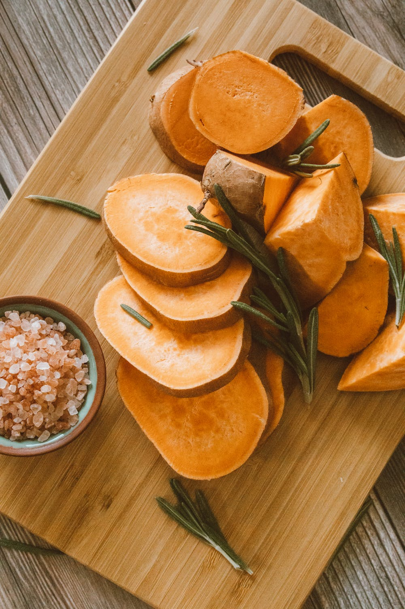

Welcome to my first Fit Recipe! On my blog you will find tasty and Fit meal ideas that can be made from fresh ingredients. I want to show you that healthy recipes can be very easy to prepare, delicious and far from boring!  Join me and let's create Fit meals together!

Today, I prepared for you a recepe for Sweet Potatoes wtih Grapefruit. It is a great option for easy lunch and dinner with one serving containing only 350 calories! Without further ado, let's get to it, shall we?

2 servings:

1 3/4 pounds sweet potatoes

1 large grapefruit

3 tablespoons unsalted butter

1/3 cup (firmly packed) light brown sugar

1/4 teaspoon salt

2 eggs, well beaten

Preheat oven to 375F.  Put the potatoes, unpeeled, in a large saucepan and cover with water.  With a swivel-bladed vegetable peeler, peel the yellow zest from the grapefruit and put it in with the potatoes. Bring to a boil, reduce the heat and simmer until the sweet potatoes are just fork-tender, about 20 minutes.

Meanwhile, with a long-pronged fork or tongs, dip the grapefruit into the boiling potato water and blanch, turning constantly, for 30 seconds. Rinse the grapefruit briefly under cold running water to cool and peel off the white pith.  Section the grapefruit and peel off the membranes over a bowl to catch the juice. Reserve all the juice and pulp; discard any seeds.

When the sweet potatoes are done, drain and let cool; discard the grapefruit zest. Peel the potatoes and put them into a food processor along with the grapefruit pulp and juice, the butter, brown sugar and salt.  Puree until smooth.  Add the eggs and mix to blend.

Pour the sweet potato mixture into a well-buttered, 6-cup souffle dish. Place in a pan of hot water and bake for 45 minutes, or until the center is set.